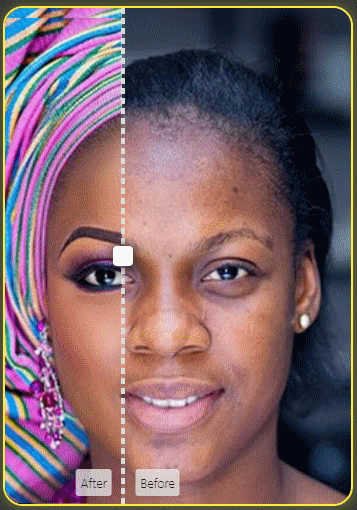

iMatch.js
====

A vanilla JavaScript mobile-friendly before/after comparison slider,
to view the difference between two images with mouse drag and touch swipe events.

Some Fetaures
----

- Both Desktop & Mobile <br>
- Built-in Animation <br>
- Touch Support <br>
- Easy to Customise CSS Style <br>
- Mobile-friendly <br>
- Easy to intergrate <br>
- Both Horizontal & Vertical Slide <br>
- Pure JavaScript

PREVIEW
------------------



check index.html in samplePage folder for live Preview.

Installation
------------------

```bash
# Basic Node.JS installation
npm install @indaneey/imatch --save
```

Syntax
------

### Import `imatch()` from imatch

```js
import { imatch } from '@indaneey/imatch';
```

Examples
--------

### Calling iMatch using `require()`

```js
var iMatch = require('imatch');
var slider = new iMatch();
```

### Calling iMatch using `script tag`

```html
<head>
<script src="imatch.min.js"></script>
</head>
```

and then in `script tag` create iMatch() instance

```js
var slider = new iMatch();
```

## Create Container With HTML Elements
---

First step, you have to create a container where you want your comparison slider to be. And add two different images inside with `` tags.

<i><small>NOTE: Don't add three HTML Elements inside your container, because it will not works on three images, only two images are allowed. Also single one image will not work. `JUST TWO(2) IMAGES!!` </small> </i>

Example
-------

```html
<div class="container">
    
    
</div>
```

### Set Data Attribute To Container

To create a caption for your slider you have to set data attribute to your image tags.

Example
-------

```html
<div class="container">
    
    
</div>
```

The data attribute must be `data-caption` then follow by your caption text.

### Set Container Size

Here is most important part. Set your container width and height using CSS. And then iMatch.js will use these properties to create your slider.

<i><small>NOTE: If not set width and height properties, the iMatch will not generate comparison slider for us.</small></i>

Example
-------

```css
.container{
    width: 300px;
    height: 600px;
}
```

## Attach Container To iMatch.js
----

After creating a container, you have to also create an iMatch instance too. And then attach them together.
Write your container `class` attribute or `id` attribute name as `iMatch()` parameter in string format

Example
-------

```js
  var slider = new iMatch('.container')
```

### compare()

iMatch.js has a method called `compare()` that will use to configure slider properties and display slider to screen.

Example
-------

```js
  var slider = new iMatch('.container')
      slider.compare()
```

<i><small>NOTE: If not write this method, the iMatch.js will not generate comparison slider for us.</small></i>

This method has different properties
- direction
- animation
- lineClassName
- arrowClassName

Example
-------

```js
  var slider = new iMatch('.container')
      slider.compare({
          direction: 'HORIZONTAL', // horizontal or vertical value required in string
          animation: true,         // Boolean
          lineClassName: 'line',   // slider line class name for CSS style in string
          arrowClassName: 'dot'    // center rectangle class name for CSS style in string
      })
```

-----
direction property [ string ] <br>
This property is used to set your slider movement direction between horizontal or vertical in string format. <br>

------
animation property [ boolean ] <br>
This property is used to enable or unable the build-in animation. <br>

------
lineClassName property [ string ] <br>
This property is a class name of slider line, it will be use to styling using CSS. <br>

_Example_

```js
  var slider = new iMatch('.container')
      slider.compare({
          lineClassName: 'line',   // slider line class name for CSS style in string
      })
```

_CSS_

```css
  .line{
    background-color: red
  }
```

------

arrowClassName property [ string] <br>
This property is a class name of center rectangle of line, it will be use to styling using CSS.

_Example_

```js
  var slider = new iMatch('.container')
      slider.compare({
          arrowClassName: 'dot',   // slider line class name for CSS style in string
      })
```

_CSS_

```css
  .dot{
    background-color: red;
    border-radius: 50%
  }
```

# iMatch.js

_Developed by Indaneey_design. for any support contact me [here](mailto:indaneeey@gmail.com)_